## vue3仿网易云音乐

#### 前言

本项目是用来提升自己的练手项目，在这里感谢[网易云音乐 NodeJS 版 API]([网易云音乐 NodeJS 版 API (binaryify.github.io)](https://binaryify.github.io/NeteaseCloudMusicApi/#/))提供的api进行项目练手，同时也感谢部分类似开源项目给予的启发

该项目完成了部分功能，但是仍然有部分功能存在bug，并且能够进行优化和提升，后续如果有充足的时间我会将它继续优化完善

#### 项目预览

[practice-云音乐](http://43.136.242.48:88)

打不开就是服务器过期了

#### 项目介绍

该项目是基于Vue3和Element-Plus组件库搭建的一个PC端音乐网站，能够通过扫码登录，听歌，看MV，浏览歌曲，歌单，专辑，MV信息等等

#### 项目技术栈

Vue3 / Vue Router / Element Plus / Axios / Pinia

#### 页面效果预览图
注意！不挂梯子图片可能不会显示
##### 首页

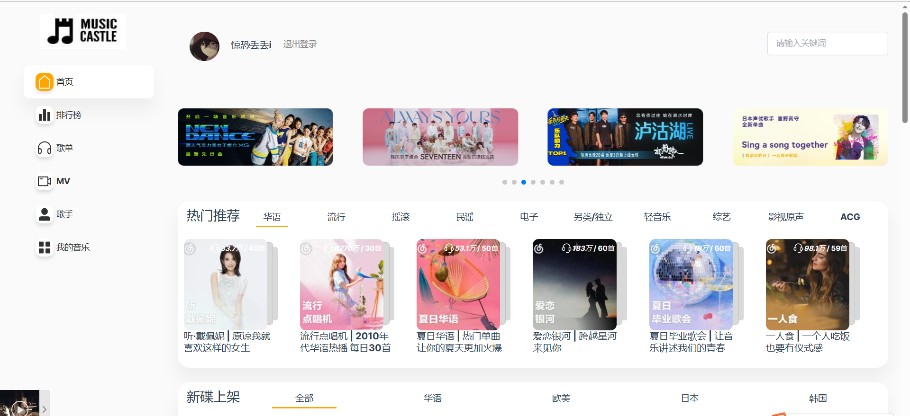

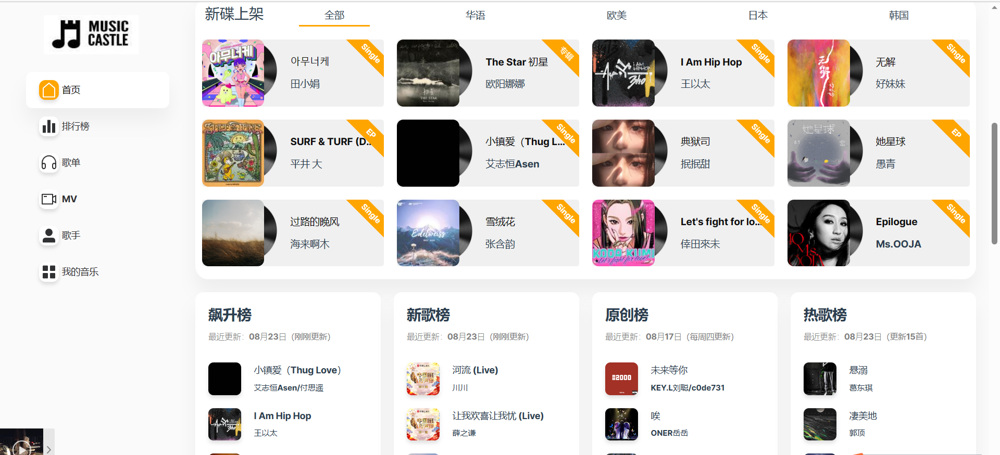

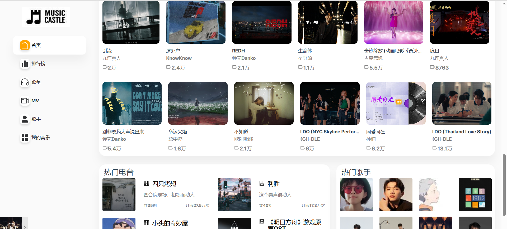

##### 排行榜

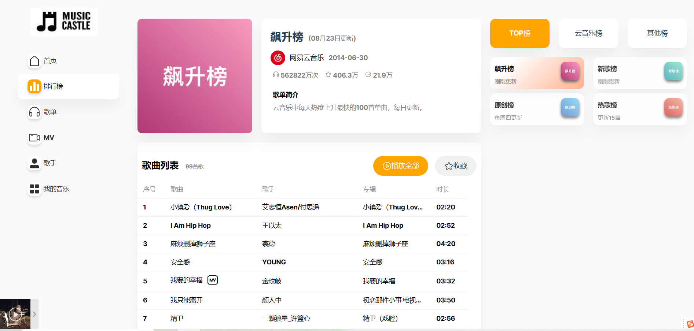

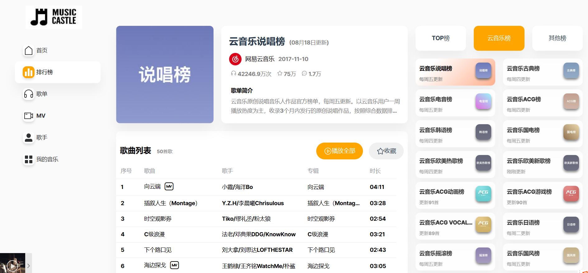

##### 歌单

展示页

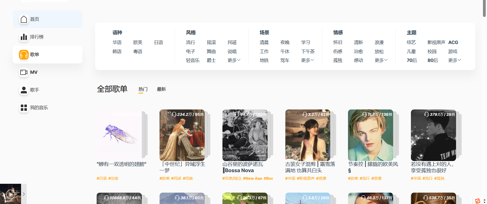

详情页

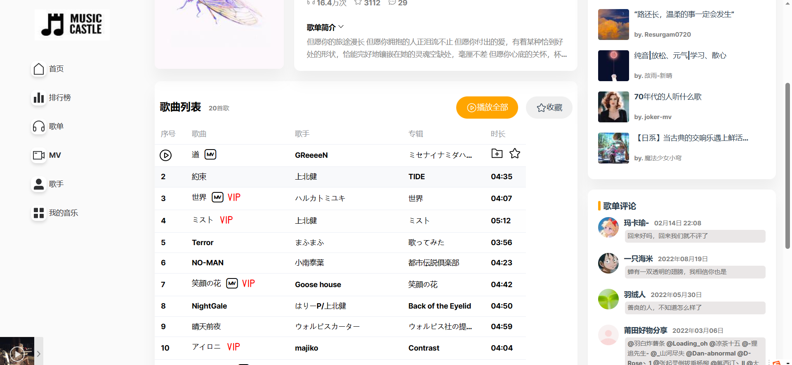

##### MV

展示页

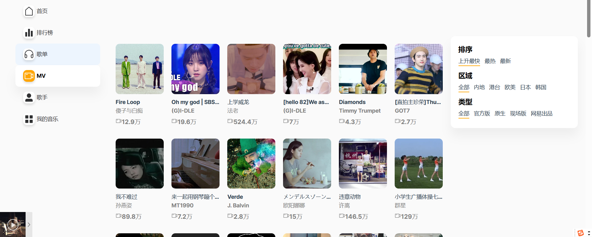

详情页

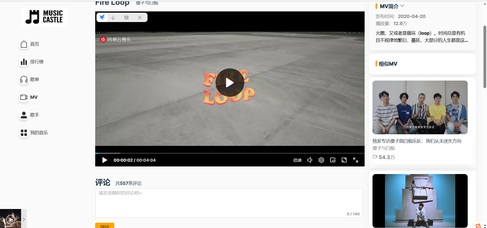

##### 歌手

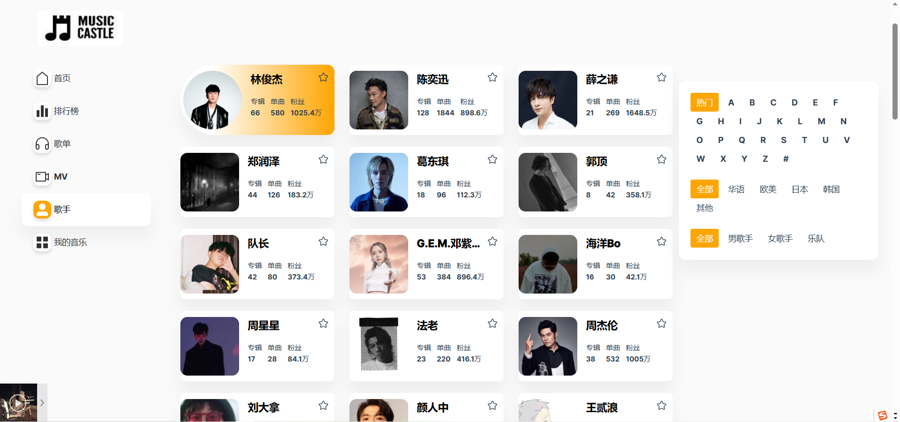

##### 我的

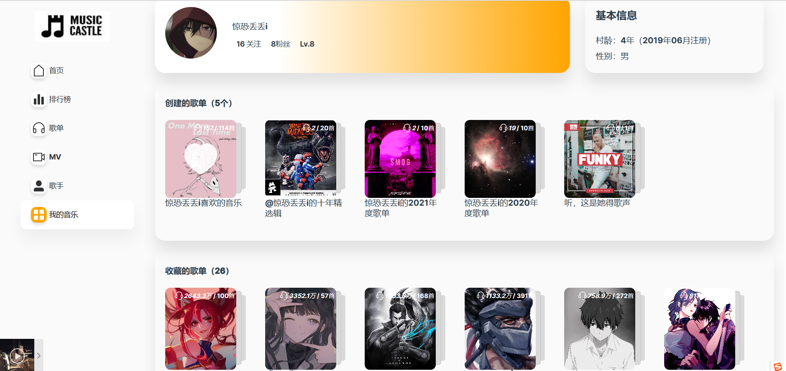

##### 单曲页面详情

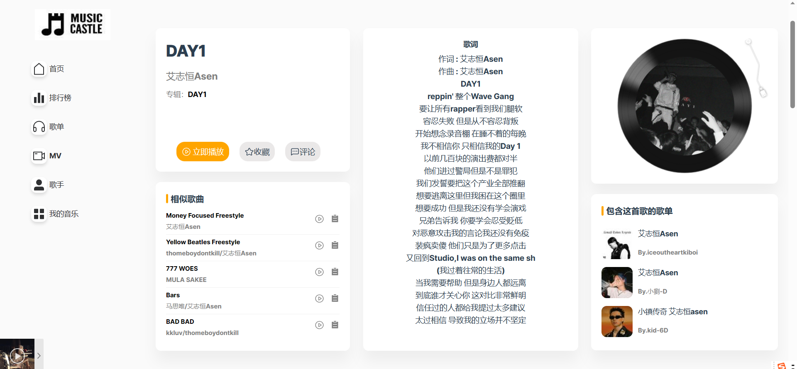

##### 音乐播放器

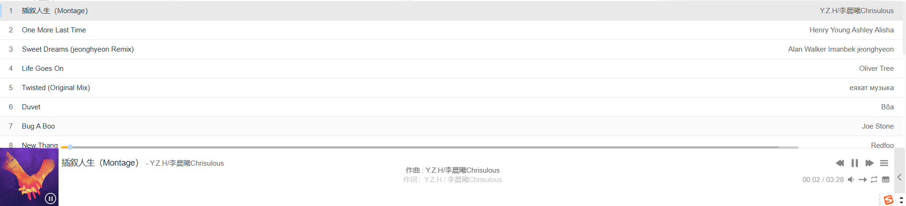

#### 后续可能会完善的功能

点赞/评论/收藏/歌手详情  等等
